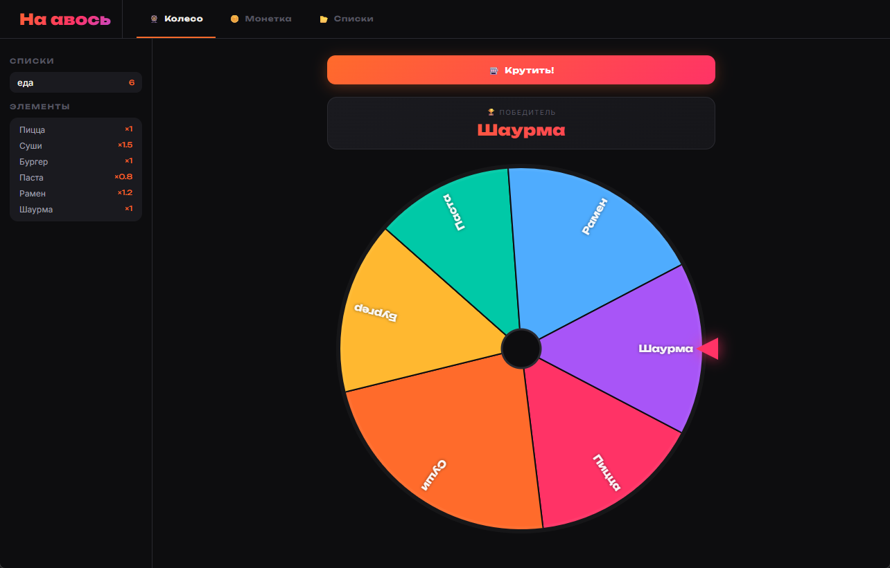

# На авось 🎡

Десктоп-рандомайзер — колесо фортуны, монетка и кастомные списки.

## Скачать

[](https://github.com/atsukhv/Na_Avos/releases/latest)

> Установка не нужна — просто запусти `.exe`  
> Требования: Windows 10 / 11

---

## Возможности

- 🎡 **Колесо фортуны** — крутится с анимацией, поддержка весов
- 🪙 **Монетка** — орёл или решка
- 📂 **Списки** — создавай, редактируй, удаляй. Хранятся в `Документы/RandomizerTemplates/`

---

## Скриншот



---


## Разработка

**Требования:** Python 3.12+, [uv](https://docs.astral.sh/uv/)

```bash
git clone https://github.com/atsukhv/Na_Avos
cd Na_Avos
uv sync
uv run python src/launcher.py
```

**Сборка exe:**
```bash
uv sync --group build
uv run pyinstaller build_windows.spec
```

---

## Стек

- [pywebview](https://pywebview.flowrl.com/) — нативное окно с Edge WebView2
- [PyInstaller](https://pyinstaller.org/) — сборка в exe
- HTML / CSS / JS — весь UI в `src/index.html`
- Python — файловые операции и рандом (`src/bridge.py`)